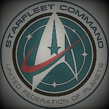

## Olá, obrigado por visitar o meu Github!

 

  

Amante de cinema, livros, séries de tv, metal, línguas, linguagens, e astrologia.

Desenvolvedor Fullstack em formação na Cubos Academy, morando em Salvador-Ba. Desejo pôr em prática ideias em tecnologia em prol da coletividade e desenvolvimento humano. 

"Engage". <i> Jean Luc Picard<i>

  
  

<!--Imagem de <https://commons.wikimedia.org/wiki/File:StarfleetCommandEmblemVectorized.svg>. A imagem foi 
estilizada com o aplicativo Fotos Microsoft.-->
