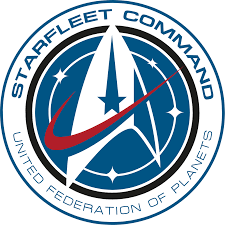

## Olá, seja bem-vind@ ao meu Github!

 

  

Amante de cinema, livros, séries de tv, metal, línguas, linguagens, e astrologia.

Aluno do curso Técnico em Desenvolvimento de Sistemas no SENAI Cimatec, em Salvador-Ba, acho tanto back end quanto front end fascinantes. Comemoro cada desafio superado no meu caminho de aprendizagem de programação. Com Urano se comunicando com o meu Ascendente, tenho ideias em tecnologia que desejo pôr em prática em prol da coletividade. 

"Engage". 
<i>Jean Luc Picard<i>

  
  

<!--Imagen de <https://commons.wikimedia.org/wiki/File:StarfleetCommandEmblemVectorized.svg>-->